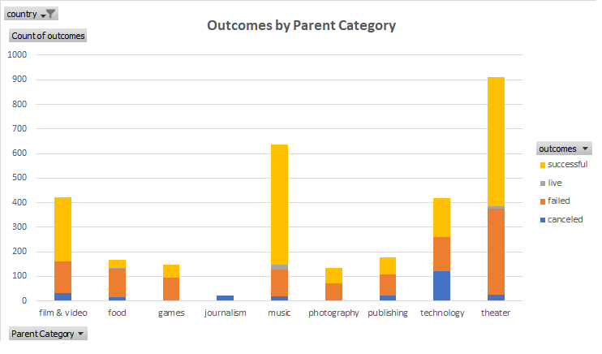

# An Analysis of Kickstarter Campaigns
This analysis was made in order to help our client, Louise, to make an informed decision on whether or not start a fundraising capaign to fund her play "Fever". Her budget estimate is $10,000.

Our results show that:

- Fundraising campaigns tend to be more successful when started from the months of May to September.
- Fundraising campaigns for the Theater category tend to be more successful compared to others. Music and Film categories follow closely.
- The Theater category also has a high number of failed campaigns, however this number is similar in other categories.
- The number of canceled campaigns is low for the Theater category compared to others.
- The "plays" subcategory, where Louise's "Fever" play falls into, has a good rate of success. 
- The "plays" subcategory had no canceled campaigns.
- The average goal of successful campaigns was $5,049 dollars, while the average goal of failed campaigns was $10.554
- Successful campaigns pledge $5,602 on average, which is very close to the average goal.
- Overall, only a small number of campaigns with a goal as high as Louise's was successful
- Of the campaigns with a goal as high as Louise's, almost half of them failed

See graphs below for reference:

